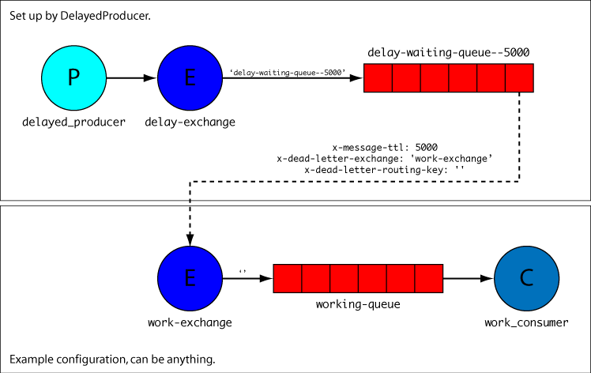

# Symfony RabbitMQ Delayed Messaging Sample

Sample Symfony project showing how to achieve delayed processing of messages in RabbitMQ using `videlalvaro/php-amqplib` and `oldsound/rabbitmq-bundle`.

The delay is achieved using temporary, consumer-less queues created on-the-fly with a message TTL and a Dead-Letter Exchange.

## Installation

First, clone the repository:

	git clone https://github.com/oscherler/rabbitmq-delayed-sample.git

Then continue to [Using Vagrant](#using-vagrant) if you are a Vagrant user, or [Without Vagrant](#without-vagrant) otherwise.

### Using Vagrant

The project includes a Vagrant file to set up a virtual machine with Apache, PHP, Composer and RabbitMQ installed. Explaining Vagrant is beyond the scope of this document, but here are some basics:

After [installing Vagrant][install_vagrant], change to the `vagrant` directory and type `vagrant up`:

	cd rabbitmq-delayed-sample/vagrant
	vagrant up

Vagrant will create the virtual machine and provision it (which is fancy lingo for “install the stuff that’s required, and then some”). It can take a few minutes and display a lot of green and red gibberish. That’s normal.

Then connect to the machine and change to the project directory:

	vagrant ssh
	cd /vagrant/rabbitmq-sample

and continue to [Set-Up](#set-up).

[install_vagrant]: https://docs.vagrantup.com/v2/getting-started/index.html

### Without Vagrant

Make sure you have PHP, Composer and RabbitMQ installed, then change to the project directory:

	cd rabbitmq-delayed-sample/rabbitmq-sample

and continue to [Set-Up](#set-up).

## Set-Up

Install the project dependencies using Composer:

	composer install

It will ask for the value of some parameters. If you are using the provided Vagrant machine, just keep the default values by hitting *Enter* until it stops asking. If you are working in your own environment, fill in the `rabbitmq_*` parameters with the values required to connect to your RabbitMQ server, and keep the default values for the remaining parameters.

## Principle

This project uses `videlalvaro/php-amqplib` and `oldsound/rabbitmq-bundle` to configure and communicate with RabbitMQ. Everything is configured under `old_sound_rabbit_mq` in `app/config/config.yml`, and a sample consumer that prints messages to the console is provided in `src/RabbitMQ/SampleBundle/Consumer/SampleConsumer.php`.

The configuration is as follows:

```yaml
old_sound_rabbit_mq:
    connections:
        default:
            host:     %rabbitmq_host%
            port:     %rabbitmq_port%
            user:     %rabbitmq_user%
            password: %rabbitmq_password%
            vhost:    %rabbitmq_vhost%
            lazy:     false

    consumers:
        # The `work-exchange` exchange will receive the messages after they have been delayed.
        # This is a sample set-up. Any configuration would do, the only important thing is to
        # configure the `delayed_producer` service with the name of the exchange declared here.
        # 
        # In this example, messages published to the `work-exchange` exchange with an empty
        # routing key (i.e. expired messages from the delay queue created by the `DelayedProducer`)
        # will be routed to the `working-queue` queue and will be consumed by this consumer.
        work_consumer:
            connection:       default
            # Declare exchange `work-exchange`.
            exchange_options: { name: 'work-exchange', type: direct }
            queue_options:
                # Declare queue `working-queue`.
                name: 'working-queue'
            # Messages are processed by the `sample_consumer` service.
            callback:         sample_consumer
```

Messages to be delayed should be published using the `delayed_producer` service with a delay in milliseconds and an empty routing key:

	$container->get('delayed_producer')->delayedPublish( 5000, $messageBody, '' );

The service takes three constructor arguments:

```yaml
# src/RabbitMQ/SampleBundle/Resources/config/services.yml
services:
    # ...
    delayed_producer:
        class: RabbitMQ\SampleBundle\Producer\DelayedProducer
        arguments:
            - @old_sound_rabbit_mq.connection.default # rabbitmq connection
            - work-exchange # destination exchange name
            - delay # delay exchange and queue prefix
```

- an AMPQ connection;
- the name of the destination exchange;
- a prefix used to name the delay exchange and the queues, to avoid naming collisions.



The `DelayedProducer` creates an exchange called `$prefix-exchange`. Then, when it receives a message, it creates a temporary queue called `'$prefix-waiting-queue-$routing_key-$delay`, with the following properties:

- `routing_keys`: same as the queue name
- `arguments`:
	- `x-message-ttl`: the delay given in `delayedPublish`, in milliseconds
	- `x-dead-letter-exchange`: the exchanged configured for the `delayed_producer` service
	- `x-dead-letter-routing-key` the routing key given in `delayedPublish`
	- `x-expires`: an expiration time slightly longer than the delay (1.1 * delay + 1 second)

Since no consumer is bound to the temporary queue, messages are never processed. The queue, however, is configured with an `x-message-ttl` argument corresponding to the desired delay. Therefore, messages expire after this delay and are discarded.

Furthermore, the queue has a *dead-letter exchange* configured, through the `x-dead-letter-exchange` and `x-dead-letter-routing-key` arguments. It means that discarded messages are re-published to the exchange given by `x-dead-letter-exchange`, which is the exchange that we configured to actually handle the messages, with the routing key given by `x-dead-letter-routing-key`, which is the routing key given when publishing to the `DelayedProducer`.

In our sampe configuration, the *dead-letter exchange* is `work-exchange`. Messages published with an empty routing key will be routed to `working-queue` and our sample consumer, which consumes from it, will therefore receive the messages after the delay given when publishing them.

The consumer is declared as service:

```yaml
# src/RabbitMQ/SampleBundle/Resources/config/services.yml
services:
	sample_consumer:
		class: RabbitMQ\SampleBundle\Consumer\SampleConsumer
		arguments: []
```

and implements `OldSound\RabbitMqBundle\RabbitMq\ConsumerInterface`:

```php
<?php

# src/RabbitMQ/SampleBundle/Consumer/SampleConsumer.php

namespace RabbitMQ\SampleBundle\Consumer;

use OldSound\RabbitMqBundle\RabbitMq\ConsumerInterface;
use PhpAmqpLib\Message\AMQPMessage;

class SampleConsumer implements ConsumerInterface
{
	public function execute( AMQPMessage $msg )
	{
		# ...
	}
}
```

## Usage

Start the consumer:

	app/console rabbitmq:consumer work_consumer

Leave it running and continue in a second terminal. If you want to stop it, type `Control-$`.

Publish a message using the `sample:test` command:

	app/console sample:test --delay 5000

and watch it (in the first terminal) being consumed after 5 seconds:

	Sent 4974 ms ago with delay 5000.

The messages published by the `sample:test` command contain the current time and the requested delay, so that the sample consumer can calculate the actual delay and display it.

Experiment with varous delays, and watch the temporary queues being created and automatically deleted in the RabbitMQ management interface.

## To Do

- Explain weird queue naming;
- Explain queue expiration.

## Credits

* [Grégoire Pineau][lyrixx] and [Olivier Dolbeau][odolbeau] for their presentation about RabbitMQ in Symfony at Symfony Live Paris 2014;

* [Alvaro Videla][old_sound] for `php-amqplib` and `rabbitmq-bundle`;

* [Udo Telaar][Telaar] and [Baptiste Clavié][talus_] for the motivation ([1][mot-1], [2][mot-2]).

[lyrixx]: https://twitter.com/lyrixx
[odolbeau]: https://twitter.com/odolbeau
[old_sound]: https://twitter.com/old_sound
[Telaar]: https://twitter.com/Telaar
[talus_]: https://twitter.com/talus_
[mot-1]: https://twitter.com/Telaar/status/535796218589614080
[mot-2]: https://twitter.com/talus_/status/536821657374318592
