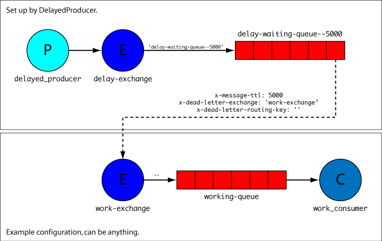

# Symfony RabbitMQ Delayed Messaging Sample

Sample Symfony project showing how to achieve delayed processing of messages in RabbitMQ using `videlalvaro/php-amqplib` and `oldsound/rabbitmq-bundle`.

The delay is achieved using a consumer-less queue with a message TTL and a Dead-Letter Exchange.

## Installation

First, clone the repository:

	git clone https://github.com/oscherler/rabbitmq-delayed-sample.git

Then continue to [Using Vagrant](#using-vagrant) if you are a Vagrant user, or [Without Vagrant](#without-vagrant) otherwise.

### Using Vagrant

The project includes a Vagrant file to set up a virtual machine with Apache, PHP, Composer and RabbitMQ installed. Explaining Vagrant is beyond the scope of this document, but here are some basics:

After [installing Vagrant][install_vagrant], change to the `vagrant` directory and type `vagrant up`:

	cd rabbitmq-delayed-sample/vagrant
	vagrant up

Vagrant will create the virtual machine and provision it (which is fancy lingo for “install the stuff that’s required, and then some”). It can take a few minutes and display a lot of green and red gibberish. That’s normal.

Then connect to the machine and change to the project directory:

	vagrant ssh
	cd /vagrant/rabbitmq-sample

and continue to [Set-Up](#set-up).

[install_vagrant]: https://docs.vagrantup.com/v2/getting-started/index.html

### Without Vagrant

Make sure you have PHP, Composer and RabbitMQ installed, then change to the project directory:

	cd rabbitmq-delayed-sample/rabbitmq-sample

and continue to [Set-Up](#set-up).

## Set-Up

Install the project dependencies using Composer:

	composer install

It will ask for the value of some parameters. If you are using the provided Vagrant machine, just keep the default values by hitting *Enter* until it stops asking. If you are working in your own environment, fill in the `rabbitmq_*` parameters with to connect to your RabbitMQ server, and keep the default values for the remaining parameters.

## Principle

This project uses `videlalvaro/php-amqplib` and `oldsound/rabbitmq-bundle` to configure and communicate with RabbitMQ. Everything is configured under `old_sound_rabbit_mq` in `app/config/config.yml` and a sample consumer that prints messages to the console is provided in `src/RabbitMQ/SampleBundle/Consumer/SampleConsumer.php`.

The configuration is the following:

```yaml
old_sound_rabbit_mq:
	connections:
		default:
			host:     %rabbitmq_host%
			port:     %rabbitmq_port%
			user:     %rabbitmq_user%
			password: %rabbitmq_password%
			vhost:    %rabbitmq_vhost%
			lazy:     false

	producers:
		# The `delayed_producer` producer publishes messages to the `delay-exchange` exchange.
		# 
		# If the routing key is '', they are routed to the `delay-waiting-queue` queue,
		# to which no consumer is connected.
		delayed_producer:
			connection:       default
			# Publish to the `delay-exchange` exchange.
			exchange_options: { name: 'delay-exchange', type: direct }
			queue_options:
				# Declare queue `delay-waiting-queue`.
				name: 'delay-waiting-queue'
				# The queue is bound to the exchange with an empty routing key ('').
				routing-keys: []
				arguments:
					# Messages in this queue expire after 5 seconds (5000 ms).
					x-message-ttl: [ 'I', 5000 ]
					# Expired messages are published back to the `delay-exchange` exchange…
					x-dead-letter-exchange: [ 'S', 'delay-exchange' ]
					# … with a routing key of 'working'.
					x-dead-letter-routing-key: [ 'S', 'working' ]

	consumers:
		# The `delayed_consumer` consumer retrieves messages from the `delay-working-queue` queue,
		# which is bound to the `delay-exchange` exchange with a routing key of 'working'.
		# 
		# Messages published to the `delay-exchange` exchange with a routing key of 'working'
		# (typically expired messages from the `delay-waiting-queue` queue) will be routed
		# to the `delay-working-queue` queue and will be consumed by this consumer.
		delayed_consumer:
			connection:       default
			# Declare the `delay-exchange` exchange.
			exchange_options: { name: 'delay-exchange', type: direct }
			queue_options:
				# Declare queue `delay-working-queue`.
				name: 'delay-working-queue'
				# The queue is bound to the `delay-exchange` exchange with an routing key of 'working'.
				routing_keys: [ working ]
			# Messages are processed by the `sample_consumer` service.
			callback:         sample_consumer
```



Messages to be delayed should be published using the `delayed_producer` producer with an empty routing key (`''`). The producer publishes messages to the `delay-exchange` exchange, and since the routing key is empty, they are routed to the `delay-waiting-queue` queue.

Since no consumer is bound to the `delay-waiting-queue` queue, messages are never processed. The queue, however, is configured with an `x-message-ttl` argument of 5000 milliseconds. Therefore, messages expire after 5 seconds and are discarded.

Furthermore, the queue has a *dead-letter exchange* configured, through the `x-dead-letter-exchange` and `x-dead-letter-routing-key` arguments. It means that discarded messages are re-published to the exchange given by `x-dead-letter-exchange` (which, in our case, is the same `delay-exchange`), with the routing key given by `x-dead-letter-routing-key`. This time, the latter, instead of being empty, is set to `working`, which means that the re-posted message will now be sent to the `delay-working-queue` queue, since it is bound to the `delay-exchange` exchange with the `working` routing key.

Our sample consumer consumes from the `delay-working-queue` queue, and will therefore receive messages after the delay given in `x-message-ttl`. The consumer is declared as service:

```yaml
# src/RabbitMQ/SampleBundle/Resources/config/services.yml
services:
	sample_consumer:
		class: RabbitMQ\SampleBundle\Consumer\SampleConsumer
		arguments: []
```

and implements `OldSound\RabbitMqBundle\RabbitMq\ConsumerInterface`:

```php
<?php

# src/RabbitMQ/SampleBundle/Consumer/SampleConsumer.php

namespace RabbitMQ\SampleBundle\Consumer;

use OldSound\RabbitMqBundle\RabbitMq\ConsumerInterface;
use PhpAmqpLib\Message\AMQPMessage;

class SampleConsumer implements ConsumerInterface
{
	public function execute( AMQPMessage $msg )
	{
		echo $msg->body . "\n";
	}
}
```

## Usage

Start the consumer:

	app/console rabbitmq:consumer delayed_consumer

Leave it running and continue in a second terminal. If you want to stop it, type Control-$.

Publish a message using the `rabbitmq:stdin-producer`:

	echo Hello | app/console rabbitmq:stdin-producer delayed_producer

and watch it (in the first terminal) being consumed after 5 seconds.

## Credits

* [Grégoire Pineau](https://twitter.com/lyrixx) and [Olivier Dolbeau](http://twitter.com/odolbeau) for their presentation about RabbitMQ in Symfony at Symfony Live Paris 2014;

* [Alvaro Videla](https://twitter.com/old_sound) for `php-amqplib` and `rabbitmq-bundle`;

* [Udo Telaar](http://twitter.com/Telaar) and [Baptiste Clavié](http://twitter.com/talus_) for the motivation [(1)](http://twitter.com/Telaar/status/535796218589614080) [(2)](http://twitter.com/talus_/status/536821657374318592).
